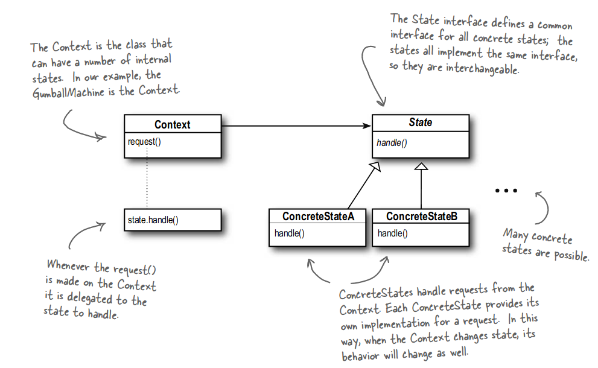
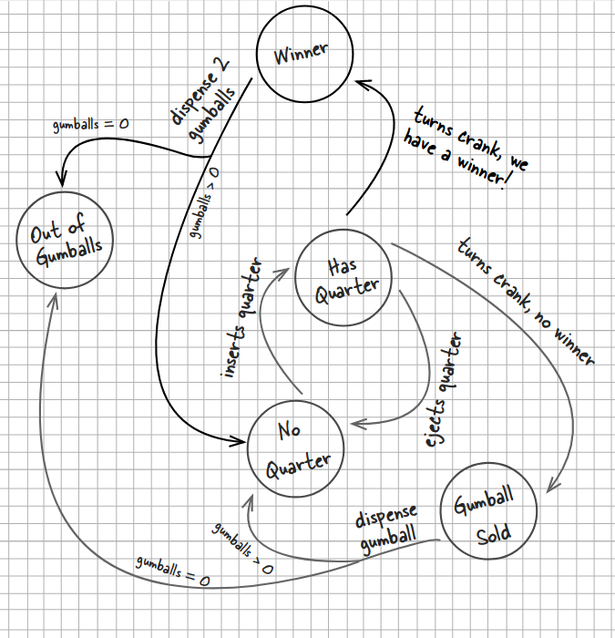
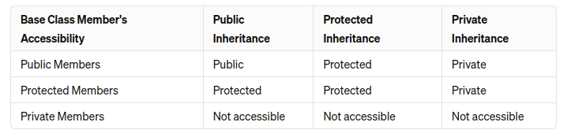

## State Pattern

The State Pattern allows an object to alter its behavior when its internal state changes. The state pattern encapsulates
state into separate classes and delegates to the object representing
the current state, we know that behavior changes along with the internal state.

With the State Pattern, we have a set of behaviors encapsulated in state objects; at any time the context is delegating
to one of those states. Over time, the current state changes across the set of state objects to reflect the internal
state of the context, so the context’s behavior changes over time as well. The client usually knows very little, if
anything, about the state objects.

## Problem State Machine

## Knowledge used in this example

### Accessibility Of CPP Inheritance

### Method overriding in C++
When overriding a method from a base class in a child class in C++, you must ensure that the accessibility of the
overriding method is consistent with the accessibility of the overridden method. The accessibility of the overriding
method must be **at least as accessible** as the overridden method.

Here's what this means:

- If the overridden method in the base class is public, then the overriding method in the derived class can be either
public or protected (in the case of protected inheritance). However, it cannot be made private.
- If the overridden method in the base class is protected, then the overriding method in the derived class must also be
protected or public (in the case of public inheritance).
- If the overridden method in the base class is private, it cannot be accessed from derived classes. Therefore, overriding
it in the derived class is not possible.
