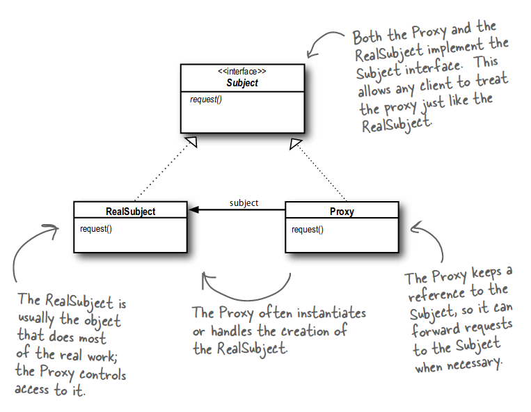

## Proxy Pattern

The Proxy Pattern provides a surrogate or placeholder for another object to control access to it.
Use the Proxy Pattern to create a representative object that controls access to another object, which may be remote,
expensive to create or in need of securing.

There are many variations of the Proxy Pattern, and the variations typically revolve around the way the proxy “controls
access.”

- A remote proxy controls access to a remote object.
- A virtual proxy controls access to a resource that is expensive to create.
- A protection proxy controls access to a resource based on access rights.

### Class Diagram

### Comparison with Decorator Pattern

The Decorator Pattern adds behavior to an object, while a Proxy controls access.

## Example
The example is a simple implementation of a protection proxy. See more details [here](https://www.robertlarsononline.com/2017/05/26/proxy-pattern-using-cplusplus/).