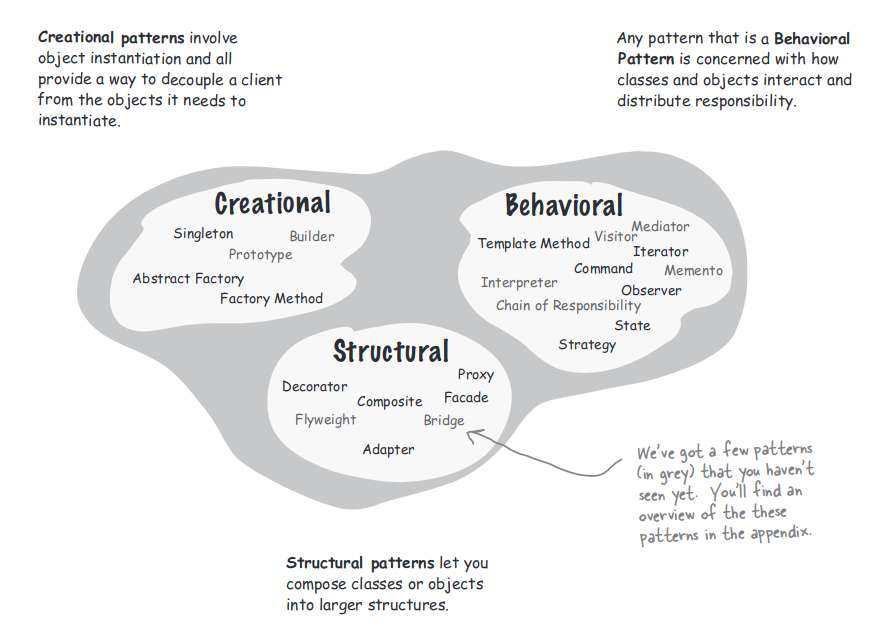

## Better Living with Patterns

A pattern is a solution to a problem in a context.

- The context is the situation in which the pattern applies, This should be a recurring problem.
- The problem refers to the goal you are trying to achieve in this context, but it also refers to any constraints that
  occur in the context.
- The solution is what you are after: a general design that anyone can apply which resolves the goal and set of
  constraints.

## Organizing Design Patterns

There are three distinct categories based on their purpioses:

- Creational Patterns. Creational patterns involve object instantiation and all provide a way to decouple a client from
  the objects it needs to instantiate.
- Behavioral Patterns. Any pattern that is a behavioral pattern is concerned with how classes and objects interact and
  distribute responsibility.
- Structural Patterns. Structural patterns let you compose classes or objects into larger structures.

## Anti-Pattern

An anti-pattern always looks like a good solution, but then turns out to be a bad solution when it is applied.

## Take-home Message

- Let Design Patterns emerge in your designs, don’t force them in just for the sake of using a pattern.
- Always use the simplest solution that meets your needs, even if it doesn’t include a pattern.
- Study Design Pattern catalogs to familiarize yourself with patterns and the relationships among them.
- Remember, most patterns you encounter will be adaptations of existing patterns, not new patterns.